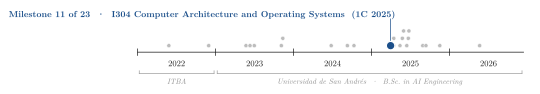
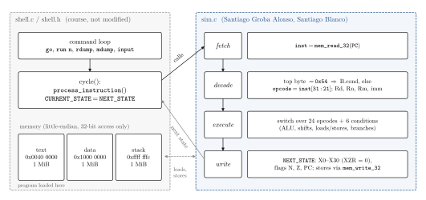
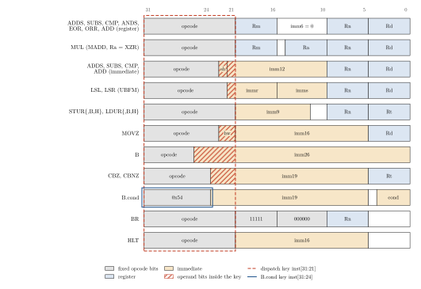

<div align="center">

# A Functional ARMv8 (A64) Instruction-Set Simulator in C

**Santiago Groba Alonso** · [Santiago Blanco](https://github.com/SantiBp21)

Universidad de San Andrés · *I304 Computer Architecture and Operating Systems* · First semester 2025 · Assignment 1

[](#reproducing-the-results)
[](#reproducing-the-results)

<picture>
  <source media="(prefers-color-scheme: dark)" srcset="docs/figures/trajectory-dark.svg">
  
</picture>

</div>

> **Abstract.** This assignment asks for the core of an instruction-level simulator for a subset of the 64-bit ARMv8 instruction set: given a program as a list of 32-bit machine words, fetch each word from simulated memory, decode it and update registers, the N and Z flags, the PC and memory exactly as the architecture manual prescribes. The course provides the shell (program loader, memory model and command loop) and a reference simulator; we wrote `src/sim.c`, which covers the 28 mnemonics in the statement with a switch keyed on instruction bits [31:21]. All 11 test programs in the repository (10 from the course, one written by the team) produce the same register, flag, PC and memory state as the reference simulator after every single instruction. Thirty additional probe programs written for this README show where the fixed 11-bit decode key breaks down: 18 match, and the 12 that diverge trace back to six decoding or semantic gaps, mostly operand bits that fall inside the key.

---

## 1. Problem

The simulator runs inside a shell written by the course (adapted from the University of Chicago's CMSC-22200 lab). The shell loads a hex program at `0x00400000`, exposes a 1 MiB data segment at `0x10000000`, and on every cycle calls `process_instruction()`, the only function the students write, before copying `NEXT_STATE` into `CURRENT_STATE`. Memory is little-endian and can only be accessed through `mem_read_32` and `mem_write_32`, so byte, half-word and 64-bit loads and stores must be built from 32-bit accesses.

Only the 64-bit variants are required, only N and Z are modelled (C and V are taken as 0, which fixes the semantics of `B.cond`), and `X31` reads as the zero register `XZR`, which turns `SUBS` into `CMP`. The required set is:

| Group | Mnemonics |
|---|---|
| Arithmetic and logic | `ADDS`, `SUBS`, `CMP` (register and immediate, immediate with `LSL #0` or `#12`), `ADD` (register and immediate), `MUL`, `ANDS`, `EOR`, `ORR` |
| Shifts and moves | `LSL`, `LSR` (immediate), `MOVZ` (`hw = 0`) |
| Loads and stores | `STUR`, `STURB`, `STURH`, `LDUR`, `LDURB`, `LDURH` |
| Control flow | `B`, `BR`, `BEQ`, `BNE`, `BGT`, `BLT`, `BGE`, `BLE`, `CBZ`, `CBNZ`, `HLT` |

The grading criterion is that the CPU state matches the reference simulator after every instruction.

## 2. Methods

<p align="center"></p>

**Figure 1.** Division of work. The course shell owns the command loop, the memory regions and the state latch; `sim.c` implements one call of `process_instruction()`: fetch, decode, execute and write the next state.

| Component | Choice |
|---|---|
| Fetch | `mem_read_32(CURRENT_STATE.PC)`; the PC advances by 4 unless a branch writes it |
| Decode | `B.cond` recognised by its top byte `0x54`; everything else dispatched on the 11-bit key `inst[31:21]`; `Rd`, `Rn`, `Rm` extracted once per instruction |
| Execute | One `switch` case per encoding (24 cases), plus a condition table for the six `B.cond` variants |
| Zero register | `get_reg_value(31)` returns 0 and `set_reg_value(31, ·)` discards the write |
| Flags | `update_flags` sets N from the sign and Z from zero of the 64-bit result |
| Immediates | Sign extension helpers for `imm9` (loads/stores) and `imm19` (`CBZ`, `CBNZ`, `B.cond`); `imm26` for `B` |
| Narrow stores | Read-modify-write of the enclosing 32-bit word (`STURB`, `STURH`); `LDUR` combines two 32-bit reads |
| Verification | Every program run on both simulators with `run 1` + `rdump` per instruction and a final `mdump` of the data segment; transcripts compared byte for byte |

<p align="center"></p>

**Figure 2.** A64 encodings of the implemented forms (64-bit variants, from the ARMv8 reference manual). The simulator dispatches on bits [31:21] (dashed). For register-format instructions those bits are all opcode, but for the immediate, bitfield, move-wide, `B` and `CBZ`/`CBNZ` formats the key also contains operand bits (hatched), so a single case value only matches part of the encoding space.

## 3. Results

### 3.1 Provided test programs

**Table 1.** The 10 course programs in `inputs/bytecodes/` and the team's own `inputs/test.x`, compared with the reference simulator `ref_sim_x86` after every instruction (registers, N, Z, PC, instruction count) and on the first 20 bytes of the data segment at the end. Output of `docs/figures/compare_ref.sh`.

| Program | Instructions executed | Exercises | State identical to reference |
|---|---:|---|:---:|
| `addis` | 4 | `ADDS` immediate | yes |
| `adds` | 3 | `ADDS` immediate and register | yes |
| `adds-subs` | 6 | `ADDS`, `SUBS` | yes |
| `subis` | 4 | `SUBS` immediate | yes |
| `ands` | 4 | `ANDS` | yes |
| `eor` | 6 | `EOR` | yes |
| `movz` | 5 | `MOVZ` | yes |
| `beq` | 5 | `CMP`, `BEQ` | yes |
| `blt` | 4 | `CMP`, `BLT` | yes |
| `sturb` | 9 | `LSL`, `STUR`, `STURB`, `LDUR`, `LDURB` | yes |
| `test` (team) | 12 | `MOVZ`, `ADD`, `MUL`, `CBZ`, `CBNZ`, `B` | yes |
| **Total** | **62** | | **11 / 11** |

### 3.2 Beyond the provided programs

The provided programs only use small, unshifted immediates and forward branches. To see how far the agreement extends, we assembled 30 short probe programs with the course toolchain, each targeting one instruction form, and compared them in the same way.

**Table 2.** Probe programs grouped by instruction family (`compare_ref.sh --probes`).

| Family | Probes | Identical | Where the state diverges |
|---|---:|---:|---|
| Register arithmetic and logic (`ADD`, `SUBS`, `CMP`, `ANDS`, `ORR`, `MUL`) | 6 | 6 | — |
| Immediate arithmetic (`ADDS`, `SUBS`, `ADD`, `CMP`) | 6 | 2 | `LSL #12` or `imm12` ≥ 2048 sets bit 22 or 21, so the key no longer matches and the instruction is skipped |
| Shifts (`LSL`, `LSR`) | 5 | 2 | `LSL` by more than 32 and `LSR` by 32 or more are swapped (bit 21 is `immr[5]`); both also update N and Z, which the reference leaves unchanged |
| Loads and stores | 3 | 1 | `STUR` writes only the low 32 bits; the `STURH` case constant (`0x3E1`) does not match its encoding (`0x3C0`) |
| Branches (`B`, `BR`, `B.cond`, `CBZ`, `CBNZ`) | 10 | 7 | Backward `B`, `CBZ` and `CBNZ`: the sign bits of the offset fall inside the key; `B.cond`, keyed on the top byte, works in both directions |
| **Total** | **30** | **18** | |

## 4. Takeaways

- A single fixed-width dispatch key is the shortest way to decode A64, but it is only correct for formats whose opcode spans the whole key. Matching on per-format masks (`(inst & mask) == pattern`), as the `B.cond` path already does, covers every operand value.
- Lock-step comparison against a reference after every instruction is a stronger test than comparing final states, but it is only as good as the programs fed to it: every divergence in Table 2 needs an operand value the provided programs never use.
- Building byte, half-word and double-word accesses from a 32-bit memory interface makes the little-endian layout concrete: each narrow store is a read-modify-write and each wide access is two transactions.

## Reproducing the results

The reference simulator `ref_sim_x86` and the bundled toolchain are x86-64 Linux binaries; `ref_sim_arm` is an AArch64 Linux build of the same reference.

```bash
cd src && make                         # gcc -g -O0 shell.c sim.c -o sim
./sim ../inputs/bytecodes/adds.x       # shell commands: go, run <n>, rdump, mdump <lo> <hi>, input <reg> <val>, ?, quit
cd ..
bash docs/figures/compare_ref.sh             # Table 1
bash docs/figures/compare_ref.sh --probes    # Table 2 (assembles with aarch64-linux-android-4.9)
python docs/figures/make_figures.py          # Figures 1–2 (matplotlib)
```

New test programs follow the course workflow: write `inputs/<name>.s`, run `./asm2hex <name>.s` inside `inputs/` (after `chmod +x asm2hex`), then load `<name>.x` in both `src/sim` and `./ref_sim_x86` (after `chmod +x ref_sim_x86`) and compare `rdump`/`mdump` output.

| File | Content | Origin |
|---|---|---|
| `src/sim.c` | The simulator: decode, execute and state update | Team |
| `inputs/test.s`, `inputs/test.x` | Extra test for `MOVZ`, `ADD`, `MUL`, `CBZ`, `CBNZ`, `B` | Team |
| `src/shell.c`, `src/shell.h`, `src/Makefile` | Loader, memory model, command loop, state latch | Course (not modified) |
| `inputs/*.s`, `inputs/bytecodes/*.x` | Test programs and their machine code | Course |
| `inputs/asm2hex`, `inputs/asm2hex_3` | Assembler wrapper (`.s` → `.x`) | Course |
| `ref_sim_x86`, `ref_sim_arm` | Reference simulator used for grading | Course |
| `ref/DDI0487B_a_armv8_arm.pdf` | ARMv8 Architecture Reference Manual | Arm |
| `aarch64-linux-android-4.9/` | Android NDK GCC 4.9 assembler and binutils | Google |
| `I304_TP1_Simulador_CPU.pdf` | Assignment statement (Spanish) | Course |
| `docs/figures/` | Figure script, comparison script with the probe programs | This README |

## Acknowledgements

Assignment, shell and reference simulator by the I304 teaching staff at UdeSA (Prof. Daniel Veiga and teaching assistants), forked from [SPI-Udesa/TP_ACSO](https://github.com/SPI-Udesa/TP_ACSO) and based on the CMSC-22200 Computer Architecture lab of the University of Chicago.

## Citation

```bibtex
@misc{groba2025armsim,
  author       = {Groba Alonso, Santiago and Blanco, Santiago},
  title        = {A Functional {ARMv8} ({A64}) Instruction-Set Simulator in {C}},
  year         = {2025},
  howpublished = {Universidad de San Andr{\'e}s, I304 Computer Architecture and Operating Systems},
  url          = {https://github.com/Santi2065/TP_ACSO}
}
```
